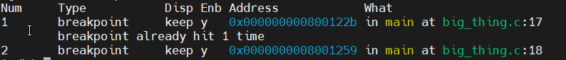
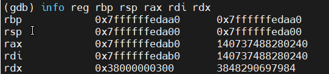
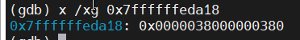
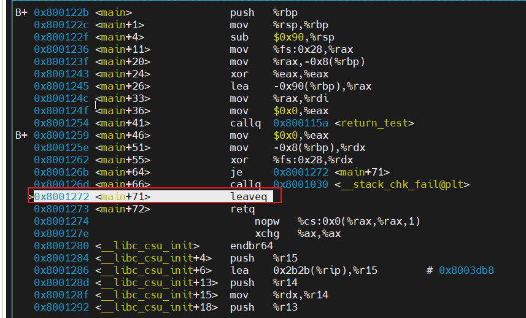

## 1、背景

最近在看 《程序员的自我修改  -- 链接、装载与库》，第10.2.3节有关于超过8字节的返回类型的代码分析。这里也进行一个简单分析，增强对函数调用栈和返回方式的理解。


## 2、测试环境

```
wsl1 ubuntu20.04
gcc 7.5.0
```


## 3、测试过程

### 3.1、源代码

C代码与书中保持一致：

```c
/*
bigthing.c
*/
typedef struct big_thing
{
    char buf[128];
}big_thing;

big_thing return_test()
{
    big_thing b;
    b.buf[0] = 0;
    return b;
}

int main()
{
    big_thing n = return_test();
}
```


### 3.2 、汇编代码

得到汇编代码：

```
gcc -S big_thing.c -o big_thing.s
```

汇编代码：

```assembly
	.file	"big_thing.c"
	.text
	.globl	return_test
	.type	return_test, @function
return_test:
.LFB0:
	.cfi_startproc
	pushq	%rbp
	.cfi_def_cfa_offset 16
	.cfi_offset 6, -16
	movq	%rsp, %rbp
	.cfi_def_cfa_register 6
	subq	$160, %rsp
	movq	%rdi, -152(%rbp)
	movq	%fs:40, %rax
	movq	%rax, -8(%rbp)
	xorl	%eax, %eax
	movb	$0, -144(%rbp)
	movq	-152(%rbp), %rax
	movq	-144(%rbp), %rdx
	movq	-136(%rbp), %rcx
	movq	%rdx, (%rax)
	movq	%rcx, 8(%rax)
	movq	-128(%rbp), %rdx
	movq	-120(%rbp), %rcx
	movq	%rdx, 16(%rax)
	movq	%rcx, 24(%rax)
	movq	-112(%rbp), %rdx
	movq	-104(%rbp), %rcx
	movq	%rdx, 32(%rax)
	movq	%rcx, 40(%rax)
	movq	-96(%rbp), %rdx
	movq	-88(%rbp), %rcx
	movq	%rdx, 48(%rax)
	movq	%rcx, 56(%rax)
	movq	-80(%rbp), %rdx
	movq	-72(%rbp), %rcx
	movq	%rdx, 64(%rax)
	movq	%rcx, 72(%rax)
	movq	-64(%rbp), %rdx
	movq	-56(%rbp), %rcx
	movq	%rdx, 80(%rax)
	movq	%rcx, 88(%rax)
	movq	-48(%rbp), %rdx
	movq	-40(%rbp), %rcx
	movq	%rdx, 96(%rax)
	movq	%rcx, 104(%rax)
	movq	-32(%rbp), %rdx
	movq	-24(%rbp), %rcx
	movq	%rdx, 112(%rax)
	movq	%rcx, 120(%rax)
	movq	-152(%rbp), %rax
	movq	-8(%rbp), %rcx
	xorq	%fs:40, %rcx
	je	.L3
	call	__stack_chk_fail@PLT
.L3:
	leave
	.cfi_def_cfa 7, 8
	ret
	.cfi_endproc
.LFE0:
	.size	return_test, .-return_test
	.globl	main
	.type	main, @function
main:
.LFB1:
	.cfi_startproc
	pushq	%rbp
	.cfi_def_cfa_offset 16
	.cfi_offset 6, -16
	movq	%rsp, %rbp
	.cfi_def_cfa_register 6
	subq	$144, %rsp
	movq	%fs:40, %rax   # 这两行用于栈检查
	movq	%rax, -8(%rbp)
	xorl	%eax, %eax
	leaq	-144(%rbp), %rax
	movq	%rax, %rdi
	movl	$0, %eax
	call	return_test
	movl	$0, %eax
	movq	-8(%rbp), %rdx
	xorq	%fs:40, %rdx
	je	.L6
	call	__stack_chk_fail@PLT
.L6:
	leave					# 相当于mov %rbp, %rsp; pop %rbp, 因此没有显示的恢复%rbp的指令
	.cfi_def_cfa 7, 8
	ret
	.cfi_endproc
.LFE1:
	.size	main, .-main
	.ident	"GCC: (Ubuntu 7.5.0-6ubuntu2) 7.5.0"
	.section	.note.GNU-stack,"",@progbits
```

### 3.3、栈变化分析


### 3.4、 gdb验证

编译程序：

```sh
gcc -g -o big_thing big_thing.c
```

调试中使用gdb指令：

```sh
b *main							# 在main函数汇编第一行添加断点
b *main+46						# 在地址为main+46指令处添加断点
info breakpoints				# 查看当前所有断点信息
disassemble  					# 查看汇编代码
p/x $rax						# 16进制查看寄存器rax的值
info reg reg_name				# 查看寄存器的值
x /2xg 0x7ffffffedab0			# 查看内存0x7ffffffedab0的值, g -- 单个值长度为8字节, x -- 以16进制显示， 2 -- 共查看两个
display /4i $pc					# 每次执行显示当前pc以下的4条汇编指令
si								# stepi,单步一条机器指令, 进入函数
s								# step,单步执行一条语句, 进入函数
layout asm						# 显示汇编
fs next							# Focus set to cmd window. 在汇编试图和cmd视图间切换
start							# 从头开始单步执行
```


在main函数汇编第一行添加断点：

```sh
b *main
```


开始运行：

```shell
r
```


显示汇编代码：

```
layout asm
```


在调用return_test返回后的第一条指令处打断点。

```shell
b *main+46
```


显示所有的断点信息：

```shell
info breakpoints
```




打印此时的rbp和rsp的值。

```shell
info reg rbp rsp
```


可以发现此时rbp的值是0，参考《程序员的自我修改  -- 链接、装载与库》的第11.1.2节  入口函数如何实现，Glibc的入口函数会先将ebp置为0。

单步执行：

```shell
si
```

打印此时的rbp和rsp的值。


查看栈顶的值，栈顶是旧的rbp的值，也就是0。

```
x /xg 0x7ffffffedb40
```


单步执行，打印此时的rbp和rsp的值。此时rbp和rsp相同，都指向栈顶。


单步执行,  打印此时的rbp和rsp的值。栈中预留了144字节的空间。有rbp - rsp  = 0x90 = 144。


此时栈中预留空间的值应该是不确定的。比如我们挑0x7ffffffedb38，0x7ffffffedaf8,  0x7ffffffedab0分别看一下。


单步执行，打印此时rbp，rsp，rax， fs的值。这一句和下一句是为了内存检查。fs的值是0，应该指向的GDT(Global Descriptor Table)或LDT(Local Descriptor Table)中的第一个元素。分段机制在《linux内核完全剖析》中有详细介绍。这里我还没有找到很简单的方法找到fs指向段的基地址。所以%fs:0x28的具体物理地址还不太清楚。


单步执行，打印此时rbp，rsp，rax， fs的值，并且查看 rbp - 8 = 0x7ffffffedb38的内存值。


单步执行。打印此时rbp，rsp，rax。主要是rax被置为0。但是这里的指令是 xor, %eax, %eax 按照道理来讲应该只有低32位被清零0了。对X86-64来讲，对32位寄存器的任何操作也会清除相应64位寄存器的前32位， 但是对16位或8位不会这样。更多信息可以参考[Why do x86-64 instructions on 32-bit registers zero the upper part of the full 64-bit register?](https://stackoverflow.com/questions/11177137/why-do-x86-64-instructions-on-32-bit-registers-zero-the-upper-part-of-the-full-6)。


单步执行。打印rbp，rsp，rax的值。可以看到， rax = rsp = rbp - 0x90 =  0x7ffffffedab0。可以发现，rax的输出和rsp，rbp略有不同。那是因为gdb  info reg的输出分别是寄存器16进制格式值和原本值( natural format)， rsp和rbp一般用于指向地址，所以natural format也是16进制形式，而rax一般保存数值，所以natural format是10进制形式。具体可参考[GDB info registers command - Second column of output](https://stackoverflow.com/questions/31026000/gdb-info-registers-command-second-column-of-output)。


单步执行，打印rbp，rsp，rax，rdi的值。可以看到rdi = rax = rsp = rbp - 0x90 =  0x7ffffffedab0。


单步执行，打印rbp，rsp，rax，rdi的值。rax置为0。


单步执行，进入return_test函数。打印rbp，rsp，rax，rdi的值。可以看到rsp值比之前小了8。打印栈顶0x7ffffffedaa8的值，此时栈顶应该保存main中调用return_test的下一条指令地址，因此此时栈顶值为0x8001259。


单步执行。打印rbp，rsp，rax，rdi的值。rsp再次减8。打印栈顶0x7ffffffedaa0的值，此时栈顶保存rbp的值。因此为0x7ffffffedb40。


单步执行。打印rbp，rsp，rax，rdi的值。rbp指向新的栈顶。


单步执行。打印rbp，rsp，rax，rdi的值。栈中预留了160字节的空间。有rbp - rsp  = 0xa0 = 160。


此时栈中预留空间的值应该是不确定的。比如我们挑0x7ffffffeda98，0x7ffffffeda48,  0x7ffffffeda00分别看一下。


单步执行。打印rbp，rsp，rax，rdi的值。这里将rdi的值保存保存到 rbp - 0x98 = 0x7ffffffeda08。打印内存0x7ffffffeda08的值，等于rdi的值。


单步执行。打印rbp，rsp，rax，rdi， fs的值。与前面一样，是为了进行内存检查。


单步执行。打印rbp，rsp，rax，rdi， fs的值。查看内存 rbp - 8 = 0x7ffffffeda98的值。是%fs:0x28位置的值。


单步执行，打印rbp，rsp，rax，rdi的值。rax被置为0。


单步执行。打印rbp，rsp，rax，rdi的值。查看 rbp - 0x90 = 0x7ffffffeda10这个字节的值，为0。这个对应代码中b.buf[0] = 0;。这里可以看到return_test中的局部变量b其实是从0x7ffffffeda10\~0x7ffffffeda8f，这128个字节。但是实际分配了160个字节。从0x7ffffffeda08开始的8字节用于保存rdi，而从0x7ffffffeda98\~0x7ffffffeda9f这8个字节保存%fs:0x28。则0x7ffffffeda00\~0x7ffffffeda07以及0x7ffffffeda90\~0x7ffffffeda97这16个字节没有使用。为什么要这么安排呢？直接分配144个字节不就好了吗？


单步执行。打印rbp，rsp，rax，rdi的值。rax = ( 0x7ffffffeda08) = rdi = 0x7ffffffedab0。为什么要保存一下rdi到栈上呢？直接把rdi的值给rax不更直接吗？


单步执行。打印rbp，rsp，rax，rdi，rdx的值。rdx = (rbp - 0x90) = (0x7ffffffeda10)。注意，只有最低地址的字节确定为0x00。其他的字节是随机值。




单步执行。打印rbp，rsp，rax，rdi，rdx，rcx的值。rcx = (rbp - 0x88) = (0x7ffffffeda18)。




接下来就是要把数据拷贝到main的big_thing了。在拷贝之间，先看一下内存地址为rax = 0x7ffffffedab0和内存地址为rax  = 0x7ffffffedab8的值。


单步执行。打印rbp，rsp，rax，rdi，rdx，rcx的值，这里将rdx的值赋值给内存地址为0x7ffffffedab0的部分。


单步执行。打印rbp，rsp，rax，rdi，rdx，rcx的值，这里将rcx的值赋值给内存地址为0x7ffffffedab8的部分。


后面的就是一直重复复制128个字节。添加断点到搬迁完成的地方， 然后继续执行

```
b *return_test+176
c
```


单步执行。打印rbp，rsp，rax，rdi，rdx，rcx的值。这里将rcx的值赋值给内存地址为rax + 0x78 = 0x7ffffffedb28的部分。


单步执行。打印rbp，rsp，rax，rdi。将内存地址rbp-0x98 = 0x7ffffffeda08的值保存到rax，这里保存的是rdi的值。而rax本身保存的就是rdi的值。所以是不变的。这一步是不是有点多余？


后面是栈检查，就不具体看了。直接到leaveq。执行leaveq之前，打印rbp，rsp，rax，rdi。


单步执行。打印rbp，rsp，rax，rdi。可以发现rbp的值恢复了，现在栈顶是返回到main函数后的执行指令地址。leaveq的作用：相当于两条指令：

```asm
movq %rbp, %rsp
popq %rbp
```


单步执行。打印rbp，rsp，rax，rdi。回到main。可以发现此时rsp，rax，rdi值是一样的。


单步执行。打印rbp，rsp，rax，rdi。此时rax置为0。这里可以看一下main的栈帧。开始的时候是在栈上开辟了0x7ffffffedb40 - 0x7ffffffedab0 = 0x90 = 144个字节的空间。从0x7ffffffedab0  ~ 0x7ffffffedb2f 之间128个字节是big_thing,  0x7ffffffedb38 ~ 0x7ffffffedb3f 是用于内存检查。 0x7ffffffedb30 ~  0x7ffffffedb37 8个字节没有用到。这个是为什么呢？


后面两条指令是内存检查，就不看了。直接到leaveq。执行leaveq之前。打印rbp，rsp，rax，rdi。




单步执行。打印rbp，rsp，rax，rdi。一切回到原点。


单步执行。到__libc_start_main。这一块就不在此次分析之列了。看一参考一下11.1节，后面分析。


## 4、其他问题

- pushq指令等同于先将栈指针减8，然后将值写到新的栈顶。因为栈是从高到低增长的，因此esp指向的地址是最低的。这个是之前没有想明白的。
- 前面的分析并不是在一次gdb过程中完成的。所以可能会有图前后数据不一致。发现后可及时验证修复。
- 后面有时间可以gdb 10.2.3节最后的返回C++类的程序。看一下C++具体是如何实现的。


第一次gdb分析，做的比较详细。


​	