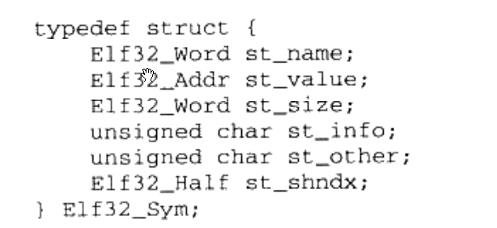
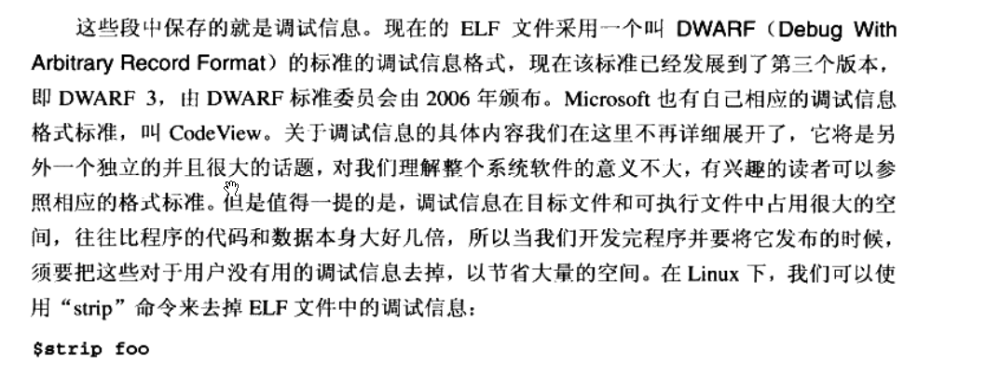
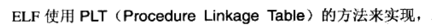
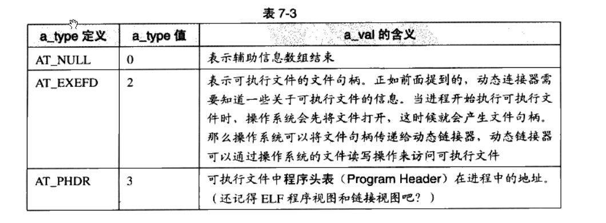
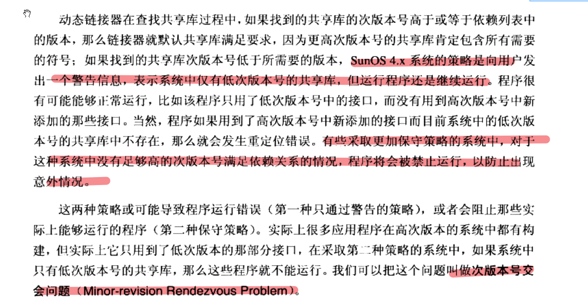

## 第一章 温故而知新

### 线程访问权限


### 线程状态切换


### 可重入情况


### 可重入函数特点


## 第二章 静态链接

### 从源代码到可执行文件过程


### 编译过程


### 词法分析结果


### 编译器前端和后端之分


### 为什么需要链接


### 链接过程分类


### 静态链接过程


## 第三章 目标文件里有什么

### 目标文件段分布


### bss段的作用


并没有占据文件空间，但是在全局的段信息中保留了大小。


### ELF文件常用段


### 如何将二进制文件作为目标文件中的一个段


### 自定义段


### ELF文件结构


### ELF文件类型


### ELF文件头结构成员含义


### 段描述符结构与成员含义


### ELF符号表结构与成员含义




### 特殊符号


### 强符号和弱符号


### 强引用和弱引用


### （问题）弱引用实例并没有得到预想的效果

	

### 调试信息格式




## 第四章 静态链接

### 目标文件、可执行文件与进程空间


### Linux下虚拟地址分配


32位程序下是这样。后面有时间可以查查现在的做法。


### 重定位表结构与成员含义


### x86基本重定位类型


### common块的作用


### 如何把未初始化的全局变量不以common块的形式处理


### C/C++程序执行流程


### ABI概念


### -fno-builtin选项的作用


### 链接过程控制方法


### BFD库


​	


## 第六章 可执行文件的装载与进程

### 程序和进程的区别


### Linux进程虚拟地址空间分布


### 装载的方式


具体参见6.2节


### 进程建立


### 建立虚拟空间与可执行文件映射关系过程


### VMA概念


### 视图概念


### 程序表头接口与成员含义


### 进程虚拟空间分布数据格式说明


### 进程VMA区域划分


### malloc申请大小影响因素


这里我本地测试出来是10G。这个后面可以看一下。单次malloc的内容上限。


### prog 123 进程初始化堆栈


### Linux内核装载ELF过程

参考第6.5节


### WindowsPE的装载

暂时不关注Windows的装载。先不看了


## 第七章 动态链接

### 静态链接的缺点


### 动态链接的基本思想


### 动态链接和静态链接内存分布的比较


### 链接时重定位和装载时重定位


### 地址无关代码的基本思想


### 地址无关代码引用方式


### -fpic和-fPIC的区别


### 如何区分一个DSO是否是PIC


### PIE


### 不同进程和线程访问共享库中的全局变量表现


### 影响动态链接性能的两个主要问题


### 延迟绑定和PLT概念




### PLT数据结构


### ELF动态链接过程概述


### 动态链接器路径问题


###  .dynamic段的数据结构与含义


### linux-gate.so.1


65位下好像已经没有这个文件了。


### dynsym  -- 动态符号表


### 动态链接辅助信息数组结构





### 动态链接进程初始化堆栈信息


### 动态链接步骤


### 动态链接器自举


### 全局符号介入与地址无关代码

	


如果模块内部定义了一个static的函数，模块外部也有一个全局的同名函数，模块内调用时会使用哪个函数呢？这个后面可以看一下。


### 动态链接初始化


### 动态链接器实现的几个问题


### 显式运行时链接


### 运行时链接函数原型与简单说明


### 符号优先级  -- 装载序列和依赖序列


## 第八章 Linux共享库的组织

### 共享库的兼容更新方式


​	


### C++ ABI兼容注意事项


### Linux共享库命名规则


### 对linux共享版本号介绍的文章

```
Library Interface Versioning in *Solaris* and *Linux*
```

https://usenix.org/legacy/publications/library/proceedings/als00/2000papers/papers/full_papers/browndavid/browndavid.pdf

https://www.usenix.org/legacy/publications/library/proceedings/als00/2000papers/papers/full_papers/browndavid/browndavid_html/index.html


### Linux下的SO-NAME

原书8.1.3节


### 库链接名


默认动态链接


### 次版本号交会问题



### 共享库的系统路径

​	

[Filesystem Hierarchy Standard](https://en.wikipedia.org/wiki/Filesystem_Hierarchy_Standard)


### 系统库查找过程


[Why LD_LIBRARY_PATH is bad](http://xahlee.info/UnixResource_dir/_/ldpath.html)


### LD_PRELOAD


	

### LD_DEBUG


### 共享库的创建和安装

参见原书8.6节


### 编译时指定共享库位置


后面找时间来搞清楚这几个参数的用法


### 共享库构造和析构函数


## 第十章 内存

### 程序环境


### Linux内存经典布局


### 段错误的常见原因


### 为什么乱码会是“烫”


### i386标准进入和退出指令序列与特殊情况


### 调用惯例包含内容


### C语言默认调用惯例

	


### 主要调用惯例内容


### 典型函数栈帧


### 为什么要有堆


### Linux两个用于对空间分配的系统调用


### malloc一次能够申请的最大空间


​	


### 堆分配算法

#### 空闲链表


#### 位图


#### 对象池


### glibc的堆分配算法


## 第十一章 运行库

### 入口函数（入口点）


### Glibc的入口函数实现

参见11.1.2节


### 什么是IO

​	


### FILE、fd、打开文件表与打开文件对象的关系


### IO初始化的职责


### 运行时库及其功能


### C语言标准库的基本函数集合


### C语言变长参数实现


真实实现：


### C语言运行库的作用


### glibc发布版本组成


### crt1.o、crti.o、crtn.o的作用


### crtbeginT.o、libgcc.a、libgcc_eh.a、crtend.o的作用


### 线程的访问权限


### CRT多线程改进


## 第十二章 系统调用和API

### 什么是系统调用


### Linux下的系统调用


### man指令的使用方法

参考

https://www.runoob.com/linux/linux-comm-man.html#:~:text=Linux%20man%20%E5%91%BD%E4%BB%A4%20Linux%20%E5%91%BD%E4%BB%A4%E5%A4%A7%E5%85%A8%20Linux%20man%20%E5%91%BD%E4%BB%A4%E6%98%AF,man%20%E5%91%BD%E4%BB%A4%EF%BC%8C%E6%82%A8%E5%8F%AF%E4%BB%A5%E8%8E%B7%E5%8F%96%E5%85%B3%E4%BA%8E%E7%89%B9%E5%AE%9A%E5%91%BD%E4%BB%A4%E6%88%96%E4%B8%BB%E9%A2%98%E7%9A%84%E8%AF%A6%E7%BB%86%E4%BF%A1%E6%81%AF%E3%80%82%20%E8%AF%AD%E6%B3%95man%20%5B%E9%80%89%E9%A1%B9%5D%20%5B%E8%8A%82%E5%8F%B7%5D%20%E5%91%BD%E4%BB%A4%2F%E4%B8%BB%E9%A2%98%20%E4%B8%80%E4%BA%9B%E5%B8%B8%E8%A7%81%E7%9A%84%E9%80%89%E9%A1%B9%E5%8C%85%E6%8B%AC%EF%BC%9A%20-f%EF%BC%9A%E6%98%BE%E7%A4%BA%E4%B8%8E%E6%8C%87%E5%AE%9A%E5%85%B3%E9%94%AE%E5%AD%97%E7%9B%B8%E5%85%B3%E7%9A%84%E6%89%8B%E5%86%8C%E9%A1%B5%E9%9D%A2%E3%80%82


### 系统调用的缺点


### 运行库的优缺点


### 特权级


### 中断


### 中断属性


### 软件中断和硬件中断


### 中断如何实现系统调用


### fork系统调用流程


### 基于int的Linux的经典系统调用实现

书本12.2.2节

- 触发中断
- 切换堆栈
- 中断处理程序
- 


### 系统调用时内核栈和用户栈的转换


### i386中断调用流程


### i386中断向量表源码地址


### Linux系统调用流程


### Linux系统调用中如何向内核传递参数


### Linux的新型系统调用机制


### 虚拟动态共享库(VDSO)


```
dd if=/proc/526953/mem of=./linux-gate.dso bs=4096 skip=4503599627367936 count=1
```


## 第十三章 运行库实现

### 按页需求分配


### miniCRT编译选项含义

 


### C++中的操作符含义


### C++ new和delete本身不负责构造和析构


### mini CRT++ 编译选项含义

 	


## 附录信息

### 字节序介绍

附录A1


### elf常见段

附录A2


### 常用开发工具命令行参考

附录A3


## 一些体会

- 要分清楚哪些事情是编译器做的，哪些事情是运行库做的。

## 结尾	


```
常用换算：
0x400  = 2^10 = 1k

0x1000 = 2^12 = 2^2 * 2^10 = 4k

0x100000 = 2^20 = 1M

0x40000000 = 2^30 = 1G

0x08048000 = 2^27 + 2^18 + 2^15 = 2^7M + 2^8K + 2^5K = 128M + 256k + 32k = 128M + 288k
```


书中关于windows的相关实现我都没有看。后面如果有需要再看吧。


