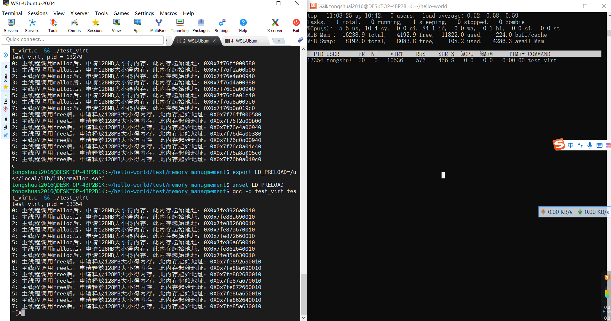
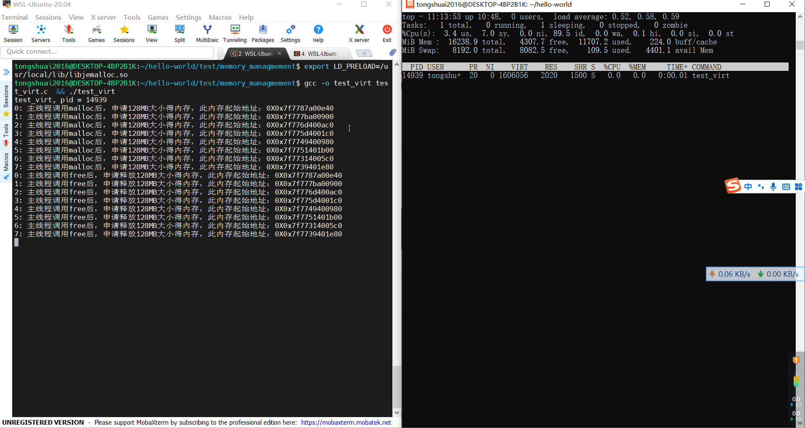
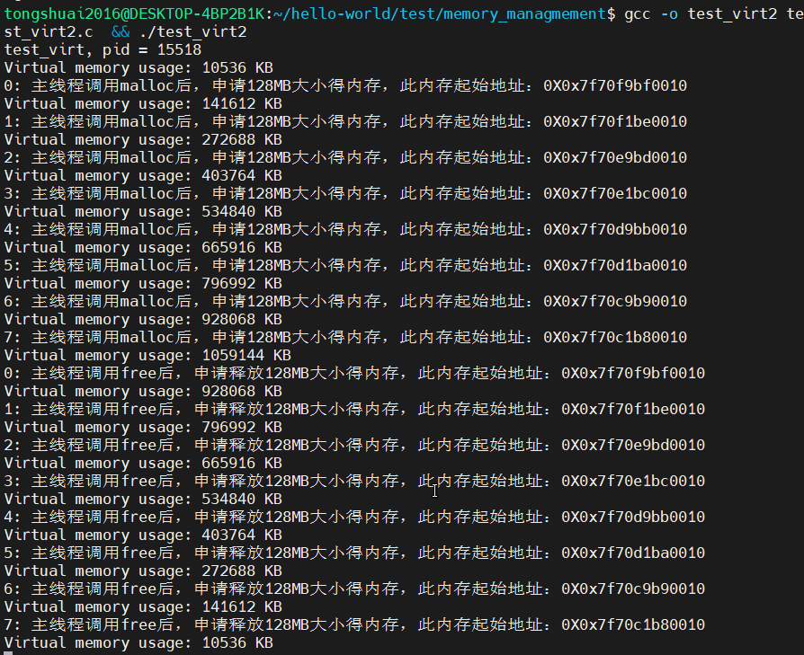
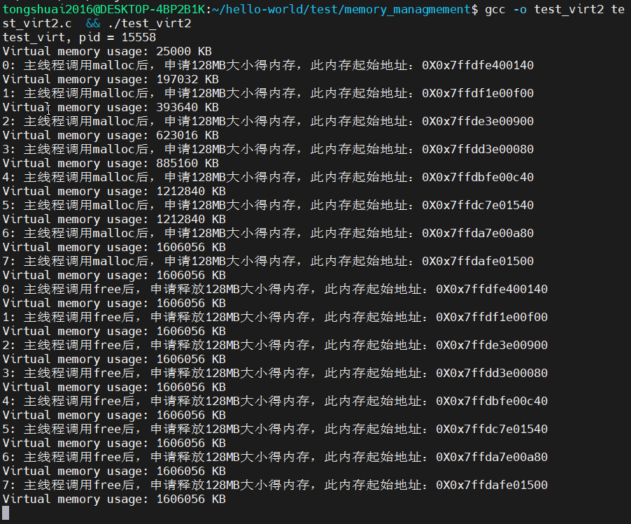

##  测试目的
对比ptmalloc和jemalloc在程序不断分配和回收内存时虚拟内存的表现。

## 测试过程
### 使用top监控
测试程序
```c
#include <stdio.h>
#include <stdlib.h>
#include <unistd.h>
#include <errno.h>
#include <string.h>

#define KB_SIZE 1024
#define MB_SIZE KB_SIZE * 1024
#define GB_SIZE  MB_SIZE * 1024
#define MEM_SIZE MB_SIZE * 128  // 每次分配128M
#define MALLOC_TIME 8           // 分配8次, 共1G

int main(void) {
    pid_t pid;
    char* addr[MALLOC_TIME];
    int i = 0;

    pid = getpid();
    printf("test_virt, pid = %d\n", pid);
    sleep(5);  // 等待5秒
    for(i = 0; i < MALLOC_TIME; ++i) {
        addr[i] = (char*) malloc(MEM_SIZE);
        if(!addr[i]) {
            printf("执行 malloc 失败, 错误：%s\n", strerror(errno));
		        return -1;
        }
        printf("%d: 主线程调用malloc后，申请128MB大小得内存，此内存起始地址：0X%p\n", i, addr[i]);
        sleep(2);  // 等待两秒
    }

    for(i = 0; i < MALLOC_TIME; ++i) {
        free(addr[i]);
        printf("%d: 主线程调用free后，申请释放128MB大小得内存，此内存起始地址：0X%p\n", i, addr[i]);
        sleep(2);  // 等待两秒
    }

    getchar();
}

// gcc -o test_virt test_virt.c  && ./test_virt
// top -p <pid>
// export LD_PRELOAD=/usr/local/lib/libjemalloc.so
// unset LD_PRELOAD
```

使用ptmalloc:


可以发现最后虚拟内存停留在一个比较低的位置上，在运行过程中，虚拟内存也会随着内存分配而增加, 内存回收而减少。

执行
```sh
export LD_PRELOAD=/usr/local/lib/libjemalloc.so
```
再次运行上面的程序
使用jemalloc:


可以发现虚拟内存停留在最高位，在运行过程中, 虚拟内存只会随着内存分配的增加而增加，并不会随着内存free而减少。

原因分析：
（应该和ptmalloc和jemalloc的内存管理方式有关， 后续学习后补充）

### 测试过程中把虚拟内存打印出来
测试程序
```c
#include <stdio.h>
#include <stdlib.h>
#include <unistd.h>
#include <errno.h>
#include <string.h>
#include <sys/resource.h>

#define KB_SIZE 1024
#define MB_SIZE KB_SIZE * 1024
#define GB_SIZE  MB_SIZE * 1024
#define MEM_SIZE MB_SIZE * 128  // 每次分配128M
#define MALLOC_TIME 8           // 分配8次, 共1G

// 参考 https://blog.csdn.net/hongge_smile/article/details/111245904
int parseLine(char *line) {
    // This assumes that a digit will be found and the line ends in " Kb".
    int i = strlen(line);
    const char *p = line;
    while (*p < '0' || *p > '9') p++;
    line[i - 3] = '\0';
    i = atoi(p);
    return i;
}

int getVmSize(pid_t target_pid) {
    FILE *file;
    char path[128];
    char line[128];
    int res;
    sprintf(path, "/proc/%d/status", target_pid);
    file = fopen(path, "r");

    while (fgets(line, 128, file) != NULL) {
        if (strncmp(line, "VmSize:", 7) == 0) {
            res = parseLine(line);
            break;
        }
    }
    fclose(file);
    return res;
}

void print_virt_mem(void) {
    int vmem;
    pid_t pid;
    pid = getpid();
    vmem = getVmSize(pid);
    printf("Virtual memory usage: %d KB\n", vmem);
}

int main(void) {
    pid_t pid;
    char* addr[MALLOC_TIME];
    int i = 0;

    pid = getpid();
    printf("test_virt, pid = %d\n", pid);
    print_virt_mem();
    for(i = 0; i < MALLOC_TIME; ++i) {
        addr[i] = (char*) malloc(MEM_SIZE);
        if(!addr[i]) {
            printf("执行 malloc 失败, 错误：%s\n", strerror(errno));
		        return -1;
        }
        printf("%d: 主线程调用malloc后，申请128MB大小得内存，此内存起始地址：0X%p\n", i, addr[i]);
        print_virt_mem();
    }

    for(i = 0; i < MALLOC_TIME; ++i) {
        free(addr[i]);
        printf("%d: 主线程调用free后，申请释放128MB大小得内存，此内存起始地址：0X%p\n", i, addr[i]);
        print_virt_mem();
    }

    getchar();
}

// gcc -o test_virt2 test_virt2.c  && ./test_virt2
// top -p <pid>
// export LD_PRELOAD=/usr/local/lib/libjemalloc.so
// unset LD_PRELOAD
```

ptmalloc:



jemalloc:


结论如上。